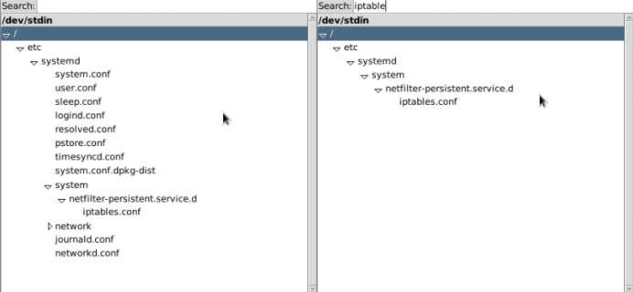

hierarchy viewer
================

Displays interactive hierarchy tree of your input.

Accepts stdin or file. Expects path-like strings, members must be separated by slashes (`/root/1/2/3`)

Poor performance, ineffective algo, still works.

Example usage:

```shell
$ find /etc/systemd/ -type f | ./tree.py
```

```shell
$ find /etc/systemd > /tmp/1
$ cat /tmp/1
/etc/systemd/networkd.conf
/etc/systemd/journald.conf
...


./tree.py /tmp/1
```

Screenshots:


